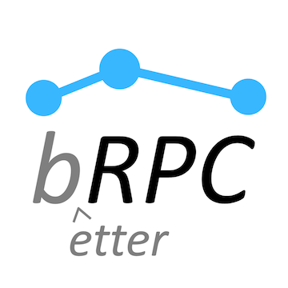

[中文版](README_cn.md)

# 

brpc is an Industrial-grade RPC framework using C++ Language, which is often used in  high performance system such as Search, Storage, Machine learning, Advertisement, Recommendation etc.

### "brpc" means "better RPC". 

You can use it to:
* Build a server that can talk in multiple protocols (**on same port**), or access all sorts of services
  * restful http/https, [h2](https://http2.github.io/http2-spec)/[gRPC](https://grpc.io). using http/h2 in brpc is much more friendly than [libcurl](https://curl.haxx.se/libcurl/). Access protobuf-based protocols with HTTP/h2+json, probably from another language.
  * [redis](docs/en/redis_client.md) and [memcached](docs/en/memcache_client.md), thread-safe, more friendly and performant than the official clients.
  * [rtmp](https://github.com/brpc/brpc/blob/master/src/brpc/rtmp.h)/[flv](https://en.wikipedia.org/wiki/Flash_Video)/[hls](https://en.wikipedia.org/wiki/HTTP_Live_Streaming), for building [streaming services](https://github.com/brpc/media-server).
  * hadoop_rpc (may be opensourced)
  * [rdma](https://en.wikipedia.org/wiki/Remote_direct_memory_access) support (will be opensourced)
  * [thrift](docs/en/thrift.md) support,  thread-safe, more friendly and performant than the official clients.
  * all sorts of protocols used in Baidu: [baidu_std](docs/cn/baidu_std.md), [streaming_rpc](docs/en/streaming_rpc.md), hulu_pbrpc, [sofa_pbrpc](https://github.com/baidu/sofa-pbrpc), nova_pbrpc, public_pbrpc, ubrpc and nshead-based ones.
  * Build [HA](https://en.wikipedia.org/wiki/High_availability) distributed services using an industrial-grade implementation of [RAFT consensus algorithm](https://raft.github.io) which is opensourced at [braft](https://github.com/brpc/braft)
* Servers can handle requests [synchronously](docs/en/server.md) or [asynchronously](docs/en/server.md#asynchronous-service).
* Clients can access servers [synchronously](docs/en/client.md#synchronus-call), [asynchronously](docs/en/client.md#asynchronous-call), [semi-synchronously](docs/en/client.md#semi-synchronous-call), or use [combo channels](docs/en/combo_channel.md) to simplify sharded or parallel accesses declaratively.
* Debug services [via http](docs/en/builtin_service.md), and run  [cpu](docs/cn/cpu_profiler.md), [heap](docs/cn/heap_profiler.md) and [contention](docs/cn/contention_profiler.md) profilers.
* Get [better latency and throughput](docs/en/overview.md#better-latency-and-throughput).
* [Extend brpc](docs/en/new_protocol.md) with the protocols used in your organization quickly, or customize components, including [naming services](docs/cn/load_balancing.md#命名服务) (dns, zk, etcd), [load balancers](docs/cn/load_balancing.md#负载均衡) (rr, random, consistent hashing)

# Try it!

* Read [overview](docs/en/overview.md) to know where brpc can be used and its advantages.
* Read [getting started](docs/cn/getting_started.md) for building steps and play with [examples](https://github.com/brpc/brpc/tree/master/example/).
* Docs:
  * [Performance benchmark](docs/cn/benchmark.md)
  * [bvar](docs/en/bvar.md)
    * [bvar_c++](docs/cn/bvar_c++.md)
  * [bthread](docs/cn/bthread.md)
    * [bthread or not](docs/cn/bthread_or_not.md)
    * [thread-local](docs/cn/thread_local.md)
    * [Execution Queue](docs/cn/execution_queue.md)
  * Client
    * [Basics](docs/en/client.md)
    * [Error code](docs/en/error_code.md)
    * [Combo channels](docs/en/combo_channel.md)
    * [Access http/h2](docs/en/http_client.md)
    * [Access gRPC](docs/en/http_derivatives.md#h2grpc)
    * [Access thrift](docs/en/thrift.md#client-accesses-thrift-server) 
    * [Access UB](docs/cn/ub_client.md)
    * [Streaming RPC](docs/en/streaming_rpc.md)
    * [Access redis](docs/en/redis_client.md)
    * [Access memcached](docs/en/memcache_client.md)
    * [Backup request](docs/en/backup_request.md)
    * [Dummy server](docs/en/dummy_server.md)
  * Server
    * [Basics](docs/en/server.md)
    * [Serve http/h2](docs/en/http_service.md)
    * [Serve gRPC](docs/en/http_derivatives.md#h2grpc)
    * [Serve thrift](docs/en/thrift.md#server-processes-thrift-requests)
    * [Serve Nshead](docs/cn/nshead_service.md)
    * [Debug server issues](docs/cn/server_debugging.md)
    * [Server push](docs/en/server_push.md)
    * [Avalanche](docs/cn/avalanche.md)
    * [Auto ConcurrencyLimiter](docs/cn/auto_concurrency_limiter.md)
    * [Media Server](https://github.com/brpc/media-server)
    * [json2pb](docs/cn/json2pb.md)
  * [Builtin Services](docs/en/builtin_service.md)
    * [status](docs/en/status.md)
    * [vars](docs/en/vars.md)
    * [connections](docs/cn/connections.md)
    * [flags](docs/cn/flags.md)
    * [rpcz](docs/cn/rpcz.md)
    * [cpu_profiler](docs/cn/cpu_profiler.md)
    * [heap_profiler](docs/cn/heap_profiler.md)
    * [contention_profiler](docs/cn/contention_profiler.md)
  * Tools
    * [rpc_press](docs/cn/rpc_press.md)
    * [rpc_replay](docs/cn/rpc_replay.md)
    * [rpc_view](docs/cn/rpc_view.md)
    * [benchmark_http](docs/cn/benchmark_http.md)
    * [parallel_http](docs/cn/parallel_http.md)
  * Others
    * [IOBuf](docs/en/iobuf.md)
    * [Streaming Log](docs/en/streaming_log.md)
    * [FlatMap](docs/cn/flatmap.md)
    * [brpc introdution](docs/cn/brpc_intro.pptx)(training material)
    * [A tutorial on building large-scale services](docs/en/tutorial_on_building_services.pptx)(training material)
    * [brpc internal](docs/en/brpc_internal.pptx)(training material)
  * RPC in depth
    * [New Protocol](docs/en/new_protocol.md)
    * [Atomic instructions](docs/en/atomic_instructions.md)
    * [IO](docs/en/io.md)
    * [Threading Overview](docs/en/threading_overview.md)
    * [Load Balancing](docs/cn/load_balancing.md)
    * [Locality-aware](docs/cn/lalb.md)
    * [Consistent Hashing](docs/cn/consistent_hashing.md)
    * [Memory Management](docs/cn/memory_management.md)
    * [Timer keeping](docs/cn/timer_keeping.md)
    * [bthread_id](docs/cn/bthread_id.md)
  * Use cases
    * [User cases](community/cases.md)

# Contribute code
Please refer to [here](CONTRIBUTING.md).

# Feedback and Getting involved
* Report bugs, ask questions or give suggestions by [Github Issues](https://github.com/apache/incubator-brpc/issues)
* Subscribe mailing list(dev-subscribe@brpc.apache.org) to get updated with the project

# Code of Conduct
We follow the code of conduct from Apache Software Foundation, please refer it here [Link](https://www.apache.org/foundation/policies/conduct)
